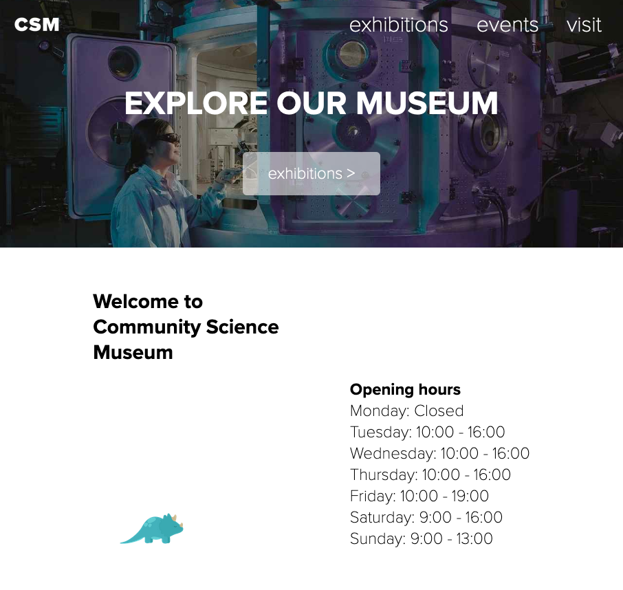

# <a href="https://rydlande.github.io/Semester_Project_1/">Semester Project 1</a>

This site is for my semester project for my first semester at Noroff School of Technology.

## Description

In the semester project, we were to create a website for a science museum. The target audience was primary and middle school children (ages 7-15) and families with young children. We were provided the media assets, such as text and images.

## Technologies Used

<ul>
    <li>HTML5</li>
    <li>CSS</li>
</ul>

## Running

To view the page, click on the link

    https://rydlande.github.io/Semester_Project_1/

## Contact

<a href="https://www.linkedin.com/in/eirin-rydland-944b49210">My LinkedIn page</a>

## Acknowledgments

Thank to my graphic designer (sister), Kristin, for helping me make the little animated dinosaurs that you can find around the website.
